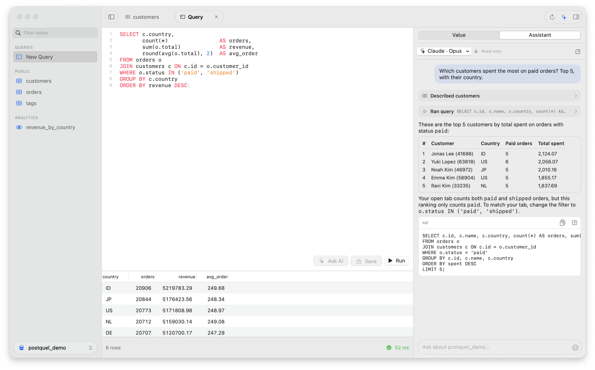

<p align="center">
  
</p>

<h1 align="center">Postquel</h1>

<p align="center">
  A fast, native PostgreSQL client for macOS, with an AI assistant that uses the Claude Code, Codex or Cursor account already on your Mac.
</p>

<picture>
  <source media="(prefers-color-scheme: dark)" srcset="docs/screenshot-dark.png">
  
</picture>

## Features

- **Tables** — browse and edit rows, follow foreign keys, and switch between Content, Structure and DDL. Structure edits columns, indexes, constraints and notes, then saves them in one transaction after an SQL preview.
- **Queries** — a SQL editor with highlighting and line numbers, results you can sort by clicking a header, and query timing.
- **Assistant** — ask about your data in plain language, or describe a query and get SQL. It reads the real schema and runs read-only queries; changes are only ever proposed, for you to dry-run and apply.
- **Bring your own AI** — uses Claude Code, Codex or Cursor Agent, whichever is installed and signed in. Pick any of their models. No API keys are stored in Postquel.
- **Native** — SwiftUI and AppKit on libpq, with Liquid Glass on macOS 26. SSH tunnels and Keychain passwords included.

Postquel is a prototype and a work in progress.

## Download

**[Download Postquel for Mac](https://github.com/frizurd/postquel/releases/latest/download/Postquel.dmg)** — macOS 15 or later, Apple silicon and Intel. Signed and notarized by Apple.

Open the DMG and drag Postquel to Applications. For the assistant, install and sign in to [Claude Code](https://claude.com/claude-code), [Codex](https://developers.openai.com/codex/cli) or [Cursor Agent](https://cursor.com/cli). Release notes are on the [releases page](https://github.com/frizurd/postquel/releases).

## Build from source

Requires Xcode / Swift 6 and libpq (defaults to Postgres.app; set `LIBPQ_PREFIX` for Homebrew `libpq`).

```sh
./scripts/build-app.sh --install   # build, install to /Applications, relaunch if running
./scripts/dev.sh                   # watch mode: rebuild + reinstall + relaunch on every change
./scripts/build-dmg.sh             # universal app in a DMG, for distribution
swift run                          # run without bundling
```

The app bundles libpq and the OpenSSL libraries it uses (from Postgres.app, or `LIBPQ_PREFIX`), so it runs on Macs without Postgres installed. To sign and notarize a DMG, set `DEVELOPER_ID` to a "Developer ID Application" identity and `NOTARY_PROFILE` to a profile saved with `xcrun notarytool store-credentials`; see `scripts/build-dmg.sh`.

Demo data: `createdb postquel_demo && psql postquel_demo -f scripts/seed-demo.sql`

## Layout

- `Resources/AppIcon.png` – silver icon on dark graphite; the app build generates all macOS icon sizes
- `Resources/Logo.png` – silver mark with a transparent background
- `Resources/Licenses` – notices for the bundled libpq and OpenSSL, copied into the app
- `Sources/CLibPQ` – module map for libpq
- `Sources/Postquel/Database` – `PGConnection` (libpq on a serial queue, text results, cancel)
- `Sources/Postquel/Models` – session, table browser, query editor state
- `Sources/Postquel/Views` – `ResultsGrid` (NSTableView), `SQLEditor` (NSTextView), SwiftUI shell

## License

[MIT](LICENSE) © 2026 frizky.dev
